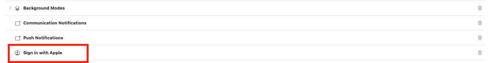

# ELEX中台账号模块


# Requirements

- iOS 12.0+
- Xcode 13.0+

# Installation

EPSDK支持[CocoaPods](https://cocoapods.org)接入，各个模块如无特殊说明，支持的最低系统版本为iOS10.0；
## CocoaPods
[CocoaPods](http://cocoapods.org) is a dependency manager for Cocoa projects. You can install it with the following command:

```bash
$ gem install cocoapods
```

```ruby
source 'git@git.elex-tech.com:opt-connect/open-ios/elex-sdk-repo.git'
source 'https://cdn.cocoapods.org'
platform :ios, '10.0'

target 'UnityFramework' do
  pod 'EPSDK_Account'
end
```
Then, run the following command:

```bash
$ pod install
```

# 接入
导入头文件
```objc
#import <EPSDK_Account/EPSDK+Account.h>
```
## 登录
接口：
```objc
/// 登录
/// @param type 登录类型
/// @param completion 完成回调
- (void)loginWithType:(EPLoginType)type complition:(void (^)(NSError *_Nullable error,EPAccount *_Nullable account))completion;
```
登录类型
```objc
/**
 * 登录类型
 */
typedef NS_ENUM(NSInteger , EPLoginType) {
    /** 自动登录 */
    EPLoginTypeAuto = 0,
    /** 游客登录 */
    EPLoginTypeGuest = 1,
    /** 渠道登录 **/
    EPLoginTypeChannel = 3,
    /** Facebook账号登录 */
    EPLoginTypeFacebook = 20,
    /** Google登录 */
    EPLoginTypeGoogle = 21,
    /** Apple账号登录 */
    EPLoginTypeApple = 23,
    /** GameCenter登录 */
    EPLoginTypeGameCenter = 24,
};
```
### 自动登录
```objc
[[EPSDK sharedSDK] loginWithType:EPLoginTypeAuto complition:^(NSError * _Nonnull error, EPAccount * _Nonnull account) {
    if(error){
    //处理失败
    }else{
    //处理登录成功
    }
 }];
```
### 游客登录
```objc
[[EPSDK sharedSDK] loginWithType:EPLoginTypeGuest complition:^(NSError * _Nonnull error, EPAccount * _Nonnull account) {
    if(error){
    //处理失败
    }else{
    //处理登录成功
    }
 }];
```
### 手机号验证码登录 | 审核渠道账号密码登录 | 邮箱登录
> <font color = red>手机号验证码登录和Umeng手机号一键登录都属于渠道登录，SDK会根据是否有Umeng登录插件和Umeng一键登录是否可用来判断使用Umeng一键登录还是手机号验证码登录;</font>
1. 引入插件
```ruby
platform :ios, '10.0'

target 'UnityFramework' do
  pod 'EPSDK_Account_ElexPassport'
#(友盟登录可选)
  pod 'ElexPassport_UMeng'
end
```
2. 添加配置文件``esdk_config.json``
```json
{
    "passport": {
        "hidePwdLogin": false,
        "oauthAppKey": "xxxxxx",
        "oauthSecret": "xxxxxx"
    },
    "isAudit": false,
}
```
- passport:
	- hidePwdLogin:是否隐藏密码登录
	- oauthAppKey:友盟手机号一键登录app key
	- oauthSecret:友盟手机号一键登录Secret
	- isAudit:是否是审核模式

```objc
[[EPSDK sharedSDK] loginWithType:EPLoginTypeChannel complition:^(NSError * _Nonnull error, EPAccount * _Nonnull account) {
    if(error){
    //处理失败
    }else{
    //处理登录成功
    }
 }];
```
### Facebook登录  
1. 引入插件
```ruby
platform :ios, '12.0’

target 'UnityFramework' do
  pod 'EPSDK_Account_Facebook'
end
```

2. 配置info.plist
- FacebookAppID:xxxxxx
- FacebookAutoLogAppEventsEnabled:（YES ｜ NO）
- FacebookClientToken:xxxxxxx
- FacebookDisplayName:xxxx
添加URL Schemes
```xml
<key>LSApplicationQueriesSchemes</key>
<array>
     <string>fbauth2</string>
     <string>fbapi</string>
     <string>fb-messenger-share-api</string>
     <string>fb-messenger-api</string>
     <string>fbshareextension</string>
</array>
```

```objc
[[EPSDK sharedSDK] loginWithType:EPLoginTypeFacebook complition:^(NSError * _Nonnull error, EPAccount * _Nonnull account) {
    if(error){
    //处理失败
    }else{
    //处理登录成功
    }
 }];
```
### Google登录  
1. 引入插件
```ruby
platform :ios, '10.0’

target 'UnityFramework' do
  pod 'EPSDK_Account_Google'
end
```
2. 添加Google配置``GoogleService-Info.plist``

```objc
[[EPSDK sharedSDK] loginWithType:EPLoginTypeGoogle complition:^(NSError * _Nonnull error, EPAccount * _Nonnull account) {
    if(error){
    //处理失败
    }else{
    //处理登录成功
    }
 }];
```

### Apple登录  
1. 配置Sign in with Apple

```objc
[[EPSDK sharedSDK] loginWithType:EPLoginTypeApple complition:^(NSError * _Nonnull error, EPAccount * _Nonnull account) {
    if(error){
    //处理失败
    }else{
    //处理登录成功
    }
 }];
```

## 退出登录
```objc
/// 退出登录
/// @param completion  退出完成的回调，error不为空时表示发生错误，退出失败
- (void)logoutWithCompletion:(void (^ _Nullable) (NSError *error))completion;
```
示例:
```objc
[[EPSDK sharedSDK] logoutWithCompletion:^(NSError * _Nonnull error) {
    if(error){
    //处理失败
    }else{
    //处理登录成功
    }
}];
```

## 重置账号
接口：
```objc
/// 重制账号
/// 使用游客重新登录
/// - Parameter completion: 完成回调
- (void)resetAccountWithComplition:(void (^)(NSError *error,EPAccount *account))completion;
```
示例:
```objc
[[EPSDK sharedSDK] resetAccountWithComplition:^(NSError * _Nonnull error, EPAccount * _Nonnull account) {
    if(error){
    //处理失败
    }else{
    //处理登录成功
    }
}];
```

## 切换账号
```objc
/// 切换账号
/// - Parameters:
///   - type: 登录类型
///   - isSilent: 是否静默
///   - completion: 完成回调
- (void)switchAccountWithType:(EPSocialPlatform)type isSilent:(BOOL)isSilent complition:(void (^)(NSError *_Nullable error,EPAccount *_Nullable account))completion;
```
示例:
```objc
EPSocialPlatform socialType; //登录社交类型
BOOL silent; //是否静默
[[EPSDK sharedSDK] switchAccountWithType:socialType isSilent:silent complition:^(NSError * _Nullable error, EPAccount * _Nullable account) {
    if(error){
    //处理失败
    }else{
    //处理登录成功
    }
}];
```

## 账号绑定
```objc
/// 绑定账号
/// - Parameters:
///   - type: 绑定类型
///   - isSilent: 是否静默
///   - completion: 完成回调
- (void)bindWithType:(EPSocialPlatform)type isSilent:(BOOL)isSilent complition:(void (^)(NSError *error,EPAccount *_Nullable account))completion;
```
示例:
```objc
EPSocialPlatform socialType ;
BOOL silent;
[[EPSDK sharedSDK] bindWithType:socialType isSilent:silent complition:^(NSError * _Nonnull error, EPAccount * _Nullable account) {
    if(error){
    //处理失败
    }else{
    //处理登录成功
    }
}];
```

## 账号解绑
```objc
/// 解绑账号
/// - Parameters:
///   - type: 解绑的类型
///   - completion: 完成回调
- (void)unBindWithType:(EPSocialPlatform)type complition:(void (^)(NSError *error,EPAccount *_Nullable account))completion;
```
示例:
```objc
EPSocialPlatform socialType;
[[EPSDK sharedSDK] unBindWithType:socialType complition:^(NSError * _Nonnull error, EPAccount * _Nullable account) {
    if(error){
    //处理失败
    }else{
    //处理登录成功
    }
}];
```


## 注销账号
```objc
/// 注销账号
/// - Parameter completion: 注销完成回调
- (void)revokeAccount:(void (^ _Nullable) (NSError *error))completion;
```
示例:
```objc
[[EPSDK sharedSDK] revokeAccount:^(NSError * _Nonnull error) {
    if(error){
    //处理失败
    }else{
    //处理登录成功
    }
}];
```

## 取消账号注销
```objc
/// 取消账号注销
/// - Parameter completion: 完成回调
- (void)cancelRevokeAccount:(void (^)(NSError *_Nullable error,EPAccount *_Nullable account))completion;
```
示例:
```objc
[[EPSDK sharedSDK] cancelRevokeAccount:^(NSError * _Nullable error, EPAccount * _Nullable account) {
    if(error){
    //处理失败
    }else{
    //处理登录成功
    }
}];
```

# 错误码
|  错误码  |       说明       |
| :-----: | :--------------: |
| 11001 | 缺少设备唯一标识 |
| 11002 | 不支持此社交类型 |
| 11003 | 切换时，社交ID未绑定用户，切换失败 |
| 11004 | 绑定社交时，同一社交账号重复绑定 |
| 11005 | 当前用户未绑定此类型的社交账号，解绑失败 |
| 11006 | 绑定时，当前用户已经绑定同类型的其他社交ID |
| 11007 | 绑定时，请求的社交ID已绑定其他账号 |
| 11008 | 缺少社交认证配置 |
| 11009 | 社交认证失败 | 
| 11010 | 解绑时，当前用户绑定同类型的其他社交ID，与请求的社交信息不匹配 |
| 11011 | 账号注销中 |
| 11012 | 解绑时，当前用户仅剩一个社交绑定关系，不能解绑 |
| 51000 | 社交SDK未初始化 |
| 51001 | 授权失败 |
| 51002 | 授权取消 |
| 51003 | 未授权 |
| 51004 | 无效的Token |
| 51005 | 操作失败 |
| 51006 | 分享等社交操作取消 |

