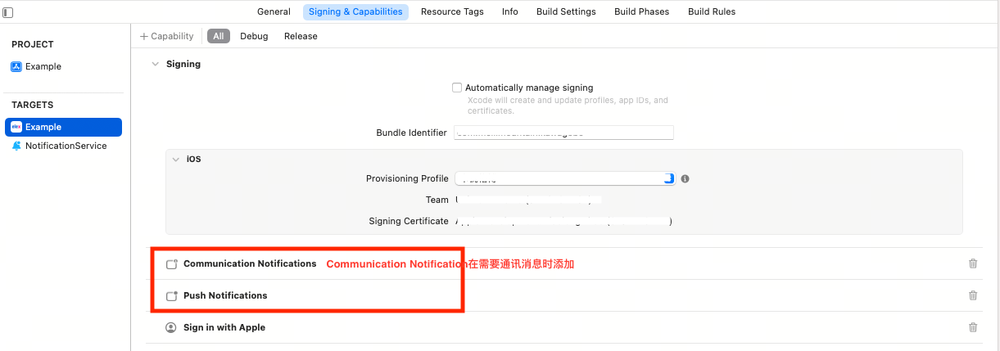
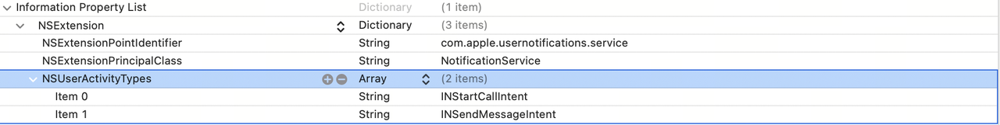
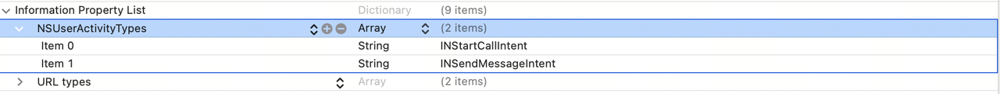
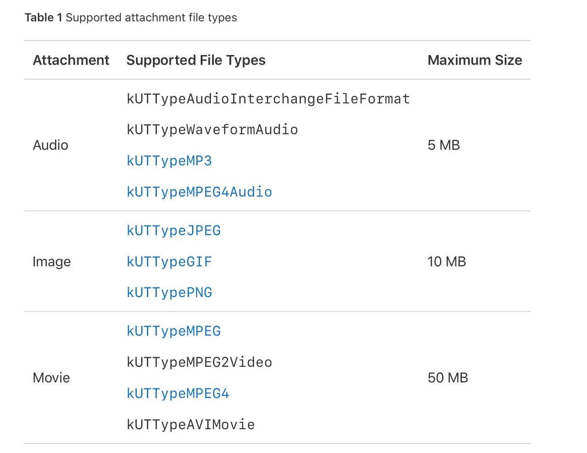

# ELEX中台推送模块
**中台推送SDK支持推送文本，图片，音频，视频和通信消息(iOS15+)；可按需接入。
图片，音频，视频和通讯消息需要添加Notification Service Extension Target，需要单独配置apple证书；**

## Requirements

- iOS 12.0+
- Xcode 13.0+

## Installation

EPSDK支持[CocoaPods](https://cocoapods.org)接入，各个模块如无特殊说明，支持的最低系统版本为iOS10.0；
### CocoaPods
[CocoaPods](http://cocoapods.org) is a dependency manager for Cocoa projects. You can install it with the following command:

```bash
$ gem install cocoapods
```

```ruby
source 'git@git.elex-tech.com:opt-connect/open-ios/elex-sdk-repo.git'
source 'https://cdn.cocoapods.org'
platform :ios, '10.0'

target 'UnityFramework' do
  pod 'EPSDK_Push’
  # 海外推送使用Firebase
  pod 'EPSDK_Push_Firebase'
end
```
Then, run the following command:

```bash
$ pod install
```

## 项目配置
### 2.1 文本消息通知
### 2.1.1 原生项目
在主Target的Signing & Capabilities中添加Push Notification；

### 2.1.2 unity项目
修改SDKConfig_iOS.json文件,将package->notification->enable设置为true；
```json
"package": {
    "notification": {
        "enable": true
    },
    // ...
},
```
Unity会自动配置工程，无需再做接入处理；
## 2.2 多媒体消息通知
[图片]
[图片]
[图片]
### 2.2.1. 原生项目
1. 添加Notification Service Extension；
2. 在Apple Developer新建宿主AppId.NotificationService的Appid，并创建证书；
3. 在podfile中的Notification Service Extension Target添加EPSDK_PushService插件；
```Ruby
target 'NotificationService' do
  pod 'EPSDK_PushService'
  pod 'EPSDK_PushReport'
end
```
4. 在Notification Service Extension中添加handler
```objc
- (void)didReceiveNotificationRequest:(UNNotificationRequest *)request withContentHandler:(void (^)(UNNotificationContent * _Nonnull))contentHandler {
    self.contentHandler = contentHandler;
    self.bestAttemptContent = [request.content mutableCopy];

    [EPPushMessageHandler handleNotificationContent:[self.bestAttemptContent mutableCopy] withHandler:contentHandler];
    [[[EPPushReport alloc] init] reportPushArrivedEventWithUserInfo:request.content.userInfo];
   
}
```
### 2.2.2. Unity项目
修改SDKConfig_iOS.json文件
```json
"package": {
    "notification": {
        "enable": true,
        "notificationServiceExtensionEnable": true
    }
    // ...
}
```
Unity会自动配置工程，无需再做接入处理；
## 2.3 通信通知（iOS 15+）
显示发送消息者的头像
[图片]
### 2.3.1.原生项目
1. 添加Communication Notification Capability；
2. 修改Notification Service Extension的info.plist，在NSExtension下添加NSUserActivityTypes

3. 修改主app的info.plist,在Root下添加NSUserActivityTypes

以上各功能都需要在iOS的证书下开启对应功能；
### 2.3.2 Unity项目
修改SDKConfig_iOS.json文件
```json
"package": {
    "notification": {
        "enable": true, //推送开关
        "notificationServiceExtensionEnable": true, //推送Extension开关
        "communicationNotificationEnable":true // 通讯消息开关
    }
}
```
Unity会自动配置工程，无需再做接入处理；
## 2.4 推送撤回
<font color = red>推送消息撤回依赖messageID，如果消息需要支持撤回，务必在原消息发送时设置messageID。<font>
### 2.4.1 原生项目
1. 添加Communication Notification Capability；
2. 添加Notification Service Extension
### 2.4.2 Unity 项目

```json
"package": {
    "notification": {
        "enable": true, //推送开关
        "notificationServiceExtensionEnable": true, //推送Extension开关
    }
}

```
红点数量:远程推送需要在推送消息中设置badge；
## 2.5 App角标自增
如果需要App的badge角标数量自增，需要添加Notification Service Extensin 和 App Groups；
App Group需要在证书中开启并设置group id；
### 2.5.1 原生项目
1. 添加Notification Service Extension；
2. 添加App Groups Capaliable;
3. 在主项目和Notification Service Extension的info.plist中添加EPPushAppGroupKey: App Group ID(group.xxxxx)的键制对；
### 2.5.2 Unity 项目
```json
"package": {
    "notification": {
      "enable": true,
      "notificationServiceExtensionEnable": true,
      "communicationNotificationEnable":true,
      "appGroupID": "group.meilimountain.kawagebo"
    },
    "signInWithAppleEnable": true,
    "gameCenterEnable": false,
    "appGroups": [
        "group.meilimountain.kawagebo"
    ]
  }
```

1. 在package中设置appGroups；
2. 在notification中添加appGroupID；必须包含在app Groups数组中；

## 3.接口

<font color = red>⚠️⚠️⚠️Push SDK在EPSDK初始化时自动请求通知权限，接入方在启动时无需处理授权逻辑<font>

### 1.通知权限
导入头文件
```objc
#import <EPSDK_Push/EPNotificationCenter+Common.h>

```

```objc
/// 获取通知权限
/// - Parameter completion: 通知权限结果回调Block，YES：用户授权；NO；用户拒绝
- (void)getNotificationAuthorizationStatus:(void(^)(BOOL notifyGranted))completion;

/// 请求用户通知权限
/// - Parameter completion: 请求用户通知权限回调Block
- (void)requestAuthorizationWithCompletion:(nullable void(^)(BOOL granted))completion;

/// 打开通知设置页面
/// - Parameter completionHandler: 完成回调Block
- (void)openNotificationSetting:(nullable void(^)(BOOL success))completionHandler;

/// 移除全部已经展示的通知；
- (void)removeAllDeliveredNotifications;

/// 清楚App icon角标
- (void)clearApplicationRedBadgeNumber;

/// 获取app的角标数量
- (NSInteger)getApplicationRedBadgeNumber;

/// 设置app角标数量
/// - Parameter number: 角标数量
- (void)setApplicationRedBadgeNumber:(NSInteger)number;

```


### 2.本地通知
导入头文件
```objc
#import <EPSDK_Push/EPNotificationCenter+Local.h>

```

```objc
/// 添加本地通知
/// - Parameters:
///   - notiContent: 通知内容
///   - completionHandler: 添加成功回调Block
- (void)addLocalNotificationWithContent:(EPLocalNotificationContent *)notiContent withCompletionHandler:(nullable void(^)(NSError *__nullable error))completionHandler;

/// 移除未分发的本地通知
/// - Parameter noticeId: 通知ID
- (void)removePendingNotificationWithID:(NSString *)noticeId;

// 移除所有未分发的本地通知
- (void)removeAllPendingNotification;

/// 获取未分发的本地通知
/// - Parameter completion: 完成回调Block
- (void)getPendingNotificationWithCompletion:(void(^)(NSArray <EPNotificationContent*>* notificationContents))completion;
```
### 3. 通知回调
#### 1.设置代理

```objc
[EPNotificationCenter defaultCenter].delegate = self;
```
#### 2.实现代理方法

```objc
@protocol EPNotificationCenterDelegate <NSObject>

/// 点击通知时调用此方法；
/// - Parameters:
///   - notificationCenter: EPNotificationCenter实例
///   - content: 通知内容
- (void)epNotificationCenter:(EPNotificationCenter *)notificationCenter didClickedNotification:(NSDictionary *)content;


/// 注册完成Remote Notification Device Token后调用此方法
/// - Parameters:
///   - notificationCenter: EPNotificationCenter实例
///   - deviceToken: 远程通知Device Token
///   - plt: Device Token平台；APNs或Firebase
- (void)epNotificationCenter:(EPNotificationCenter *)notificationCenter didRegisterForRemoteNotificationsWithDeviceToken:(NSString *)deviceToken forPlatform:(EPPushPlatform)plt;

@end

```

#### 3.点击通知回调游戏数据
- title:通知标题
- body: 通知内容
- data: 游戏透传字符串


# 4. 附录
## 支持的媒体类型和格式：


## 测试链接
### 图片:
- https://upload-images.jianshu.io/upload_images/5809200-a99419bb94924e6d.jpg
### 音频:
- https://sf3-cdn-tos.douyinstatic.com/obj/ies-music/6841476672266128135.mp3
### 视频:
- https://www.w3schools.com/html/movie.mp4
- https://media.w3.org/2010/05/sintel/trailer.mp4

## Apple Developer Doc:
1. [向 APN 发送通知请求](https://developer.apple.com/documentation/usernotifications/setting_up_a_remote_notification_server/sending_notification_requests_to_apns)
2. [生成远程通知](https://developer.apple.com/documentation/usernotifications/setting_up_a_remote_notification_server/generating_a_remote_notification)

